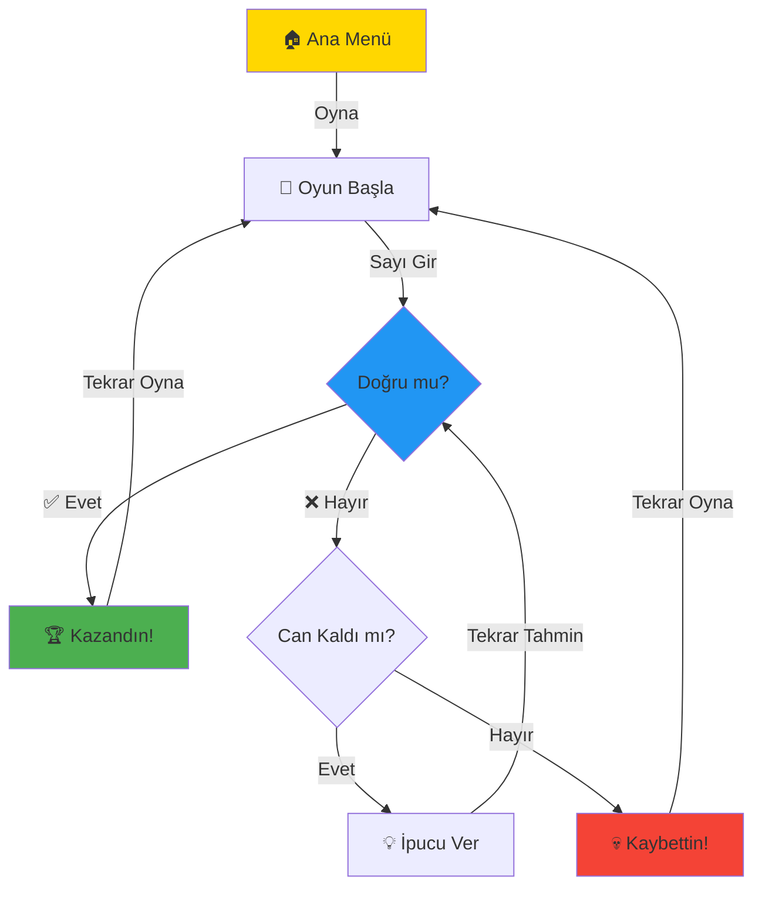

<div align="center">

# 🎯 Sayı Tahmin Oyunu

### *1-100 arası sayıyı 7 hak ile tahmin et!*


</div>

---

## 🎮 Nedir?

Klasik sayı tahmin oyununun **modern** ve **eğlenceli** Windows Forms versiyonu! Bilgisayar 1-100 arasında bir sayı tutar, sen de **7 hak** içinde tahmin etmeye çalışırsın.

<div align="center">

### ⚡ Hızlı Bakış

| 🎯 Özellik | 📝 Açıklama |
|-----------|------------|
| **7 Can Sistemi** | Her yanlış tahminde 1 can kaybedersin |
| **Akıllı İpuçları** | "Daha büyük ↑" veya "Daha küçük ↓" yönlendirmesi |
| **Tahmin Geçmişi** | Tüm tahminlerin listede görünür |
| **Ses Efektleri** | Arka plan müziği ve oyun sesleri |
| **Görsel Canlar** | Can durumunu görsel olarak takip et |
| **Kazanma/Kaybetme Ekranları** | Özel sonuç ekranları |

</div>

---

## 🌟 Özellikler

```
🎯 1-100 Arası Tahmin        ❤️ 7 Can Sistemi
📊 Tahmin Geçmişi            🎵 Müzik & Ses Efektleri  
⬆️ Akıllı Yönlendirme        🎨 Modern Arayüz
🏆 Kazanma Ekranı            💀 Kaybetme Ekranı
🔄 Tekrar Oynama             ⌨️ Enter Tuşu Desteği
```

---

## 🎮 Nasıl Oynanır?

<div align="center">



</div>

### 📋 Adım Adım

1. **🎬 Oyunu Başlat** → Ana menüden "Oyna" butonuna tıkla
2. **🎲 Başla** → "Başla" butonuna basarak oyunu başlat
3. **🔢 Tahmin Et** → 1-100 arası bir sayı gir
4. **💡 İpuçlarını Takip Et** 
   - ↑ **Daha büyük** → Tuttuğum sayı senin tahminden büyük
   - ↓ **Daha küçük** → Tuttuğum sayı senin tahminden küçük
5. **❤️ Canlarını Koru** → 7 yanlış hakkın var!
6. **🏆 Kazan veya 💀 Kaybet** → Sonuç ekranında tekrar oynayabilirsin

---

## 🎯 Oyun Mekanikleri

<div align="center">

### 🧠 Akıllı Özellikler

| Özellik | Açıklama |
|---------|----------|
| **🚫 Tekrar Kontrol** | Aynı sayıyı iki kez giremezsin |
| **✅ Geçerlilik Kontrolü** | Sadece 1-100 arası sayılar kabul edilir |
| **📝 Tahmin Listesi** | Tüm tahminlerin ok işaretleriyle gösterilir |
| **⌨️ Enter Desteği** | Enter tuşuyla hızlı tahmin |
| **🎵 Dinamik Müzik** | Her ekranın kendi müziği var |
| **🔄 Kolay Reset** | Sonuç ekranından hızlıca tekrar oyna |

</div>

---

## 🛠️ Teknik Detaylar

<div align="center">


</div>

### 💻 Teknolojiler

- **Dil:** C# 
- **Framework:** .NET Framework 4.7.2
- **UI:** Windows Forms
- **Ses:** System.Media.SoundPlayer
- **IDE:** Visual Studio

### 📁 Proje Yapısı

```
sayi_tahmin/
│
├── 📄 Form1.cs                    # Ana oyun ekranı
├── 📄 mainMenu.cs                 # Ana menü ekranı
├── 📄 KazanmaEkrani.cs           # Kazanma ekranı
├── 📄 son_EkranKaybet.cs         # Kaybetme ekranı
├── 📄 global.cs                   # Global değişkenler
├── 🎵 sesler/                     # Ses dosyaları klasörü
│   ├── Guessing-Grid.wav         # Oyun müziği
│   └── Pixel-Guess-Parade.wav    # Menü müziği
└── 📄 README.md                   # Bu dosya
```


## 📸 Ekran Görüntüleri

<div align="center">

### 🏠 Ana Menü
*Oyuna hoş geldin! Müzik eşliğinde başla*


---

### 🎯 Oyun Ekranı
*7 can, tahmin listesi ve ipuçları*


---

### 🏆 Kazanma Ekranı
*Tebrikler! Sayıyı buldun!*


---

### 💀 Kaybetme Ekranı
*Canların bitti! Tekrar dene*


</div>

---

## 🎓 Öğrenme Kaynakları

Bu projede kullanılan kavramlar:

- ✅ **Windows Forms** → GUI oluşturma
- ✅ **Random Sınıfı** → Rastgele sayı üretimi
- ✅ **List<T>** → Tahmin geçmişi saklama
- ✅ **SoundPlayer** → Ses dosyası oynatma
- ✅ **Event Handling** → Buton tıklama, klavye olayları
- ✅ **Form Geçişleri** → Ekranlar arası navigasyon
- ✅ **Global Variables** → Ekranlar arası veri paylaşımı

---


---

## 🐛 Bilinen Özellikler

- ✅ Aynı sayı tekrar girilemez
- ✅ Sadece 1-100 arası sayılar kabul edilir
- ✅ Geçersiz giriş kontrolü (harf, sembol vb.)
- ✅ Can sistemi görsel olarak takip edilebilir
- ✅ Müzik otomatik döngüde çalar

---


<div align="center">
